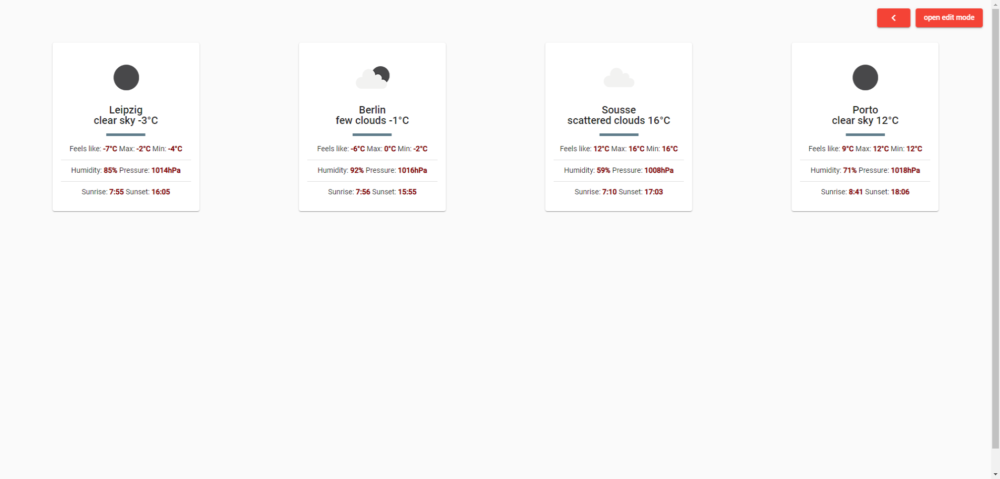

# Better Weather App

Better Weather App is a small application that can run on a raspberry pi and can be used in offices or homes to show the weather of differents cities powered by OWM, golang, angular, docker and most especially love ❤️️.

## Screenshot

## How to run

  - Generate your api key from https://openweathermap.org/api
  - rename backend/.env-example to /backend/.env and copy the api code there  
  - `docker-compose up`
  - enjoy !

## todos and ideas

   - Add TESTS!
  - Add autorefresh
  - Get a list of all the cities in OWM and use it for the search
  - Add time widget
  - Add fullscreen option
  - Hide the nav automatically when there is no activity on the page

## Contributions

Either you found a bug, or want something implemented, go ahead and hack your way into the code, PRs are welcome.

License
----

MIT
